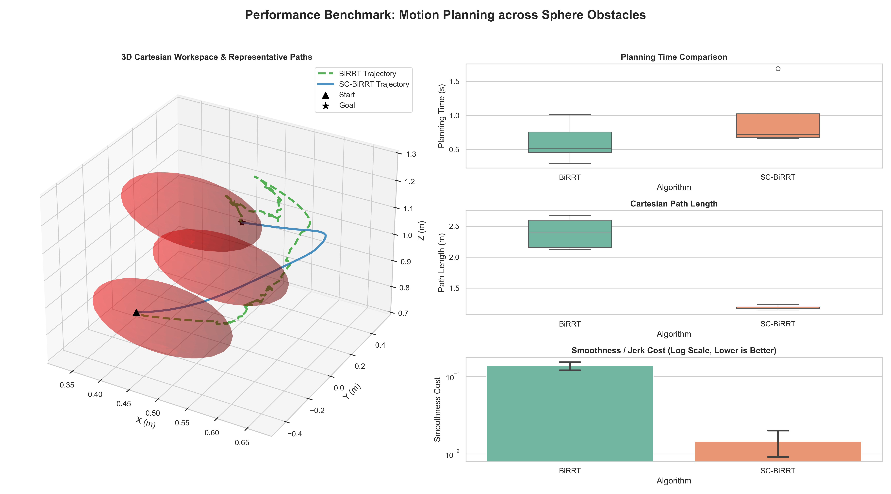

# SC-BiRRT (Smooth & Chaikin Bi-Directional RRT) for Robotic Manipulators

**SC-BiRRT** 是一种针对高维空间（如 7-DOF 机械臂）和复杂狭窄通道问题（Narrow Passage Problem）进行高度优化的机器人轨迹规划算法。本项目基于 PyBullet 物理引擎复现了极其苛刻的球体阵列避障场景，并在同一环境下对比了经典 RRT、BiRRT 和本文提出的 SC-BiRRT 的核心性能。

📈 **[📺 点击观看 Bilibili 演示视频 (TODO)](#)**

## 🚀 项目亮点 (Features)
- **硬核的狭窄通道避障场景**：告别平地规划！本场景在机械臂工作甜区精心设置了“一上一下”交错排布的 3 颗红色球体障碍物，完全封死了常规冗余构型下的直线退路，逼迫机械臂必须完成“钻缝(S型)”的高难度机动。
- **SC-BiRRT 平滑算法**：
  - ✅ **Shortcut (捷径剪枝)**：基于无碰撞直连检测，大刀阔斧裁切粗糙树枝，去除 90% 冗余折线。
  - ✅ **Chaikin Curve Subdivision (曲线细分)**：引入图形学中的曲线细分算法，替代复杂的 Scipy B样条，让折痕路径柔化为具有高阶连续性的物理可执行平滑曲线。
- **一键科研级验证基准 (Benchmark)**：自带 `paper_benchmark.py` 自动化端到端测试流。跑批后直接利用 `seaborn` 输出带有 3D 轨迹重构和三项箱型图对比指标（耗时、路径长度、抖动度）的学术论文级配图。

## 📷 性能展示 (Benchmark Results)

从下述对比图可以看出，标准的 **BiRRT** 虽然成功穿过了狭缝（绿色虚线），但其轨迹具有剧烈的抖动和无意义的迂回，极其消耗电机性能。而改进的 **SC-BiRRT**（蓝色实线）则以一条极其丝滑完美的 $C^1$ 连续流线形越过了红球防线。


> 图注: 左侧为 PyBullet 中记录的三维笛卡尔末端轨迹系复现。右侧揭示了 SC-BiRRT 极大地缩短了总行程，并且在“运动抖动代价 (Smoothness Cost)”上呈指数级（对数坐标）碾压原始算法！

## 🛠️ 安装与运行 (Installation & Usage)

项目环境需要 Python 3.8+ 及基础科学计算库。

```bash
# 1. 克隆仓库
git clone https://github.com/yourusername/SC-BiRRT.git
cd SC-BiRRT

# 2. 安装依赖 (推荐使用 Conda 虚拟环境)
pip install pybullet numpy matplotlib seaborn pandas

# 3. 运行基础可视化观测程序
python BIRRT_baseline.py

# 4. 运行科研论文的跑批对比实验（可视化实时生成）
python paper_benchmark.py
```

## 🧠 算法构成剖析
1. **逆运动学姿态筛选 (`calculateInverseKinematics + NullSpace`)**：
   在指定起点与终点时，引入随机参考姿态进行逆运动学求解过滤，确保机械臂初始/终止全身各连杆均已合法且不碰墙。
2. **连接延伸机制 (`RRT-Connect`)**：采用典型的不断试探机制，避免单向 RRT 陷入狭窄通道迷谷。
3. **后处理柔化 (`Post-processing`)**：摒弃物理控制层面的柔顺，直接在集合层用 `smooth_path_shortcutting` 拔出骨架，再由 `smooth_path_chaikin` 上皮肉。

## 📝 引用 (Citation)
如果您在机器人规划方向的研究中复用了本代码生成的狭缝场景及可视化模块，欢迎 Star 并注明来源：

```bibtex
@misc{SC-BiRRT-2026,
  author = {睿哥 (Ray)},
  title = {SC-BiRRT: Smooth \& Chaikin Bi-Directional RRT for Narrow Passage Path Planning},
  year = {2026},
  publisher = {GitHub},
  journal = {GitHub repository},
  howpublished = {\url{https://github.com/yourusername/SC-BiRRT}}
}
```

## 👨‍💻 维护者
**睿哥** (具身智能 / 机器人 / 人工智能方向研究者) 
欢迎在 Issue 中交流任意机械臂规划与强化学习探讨！